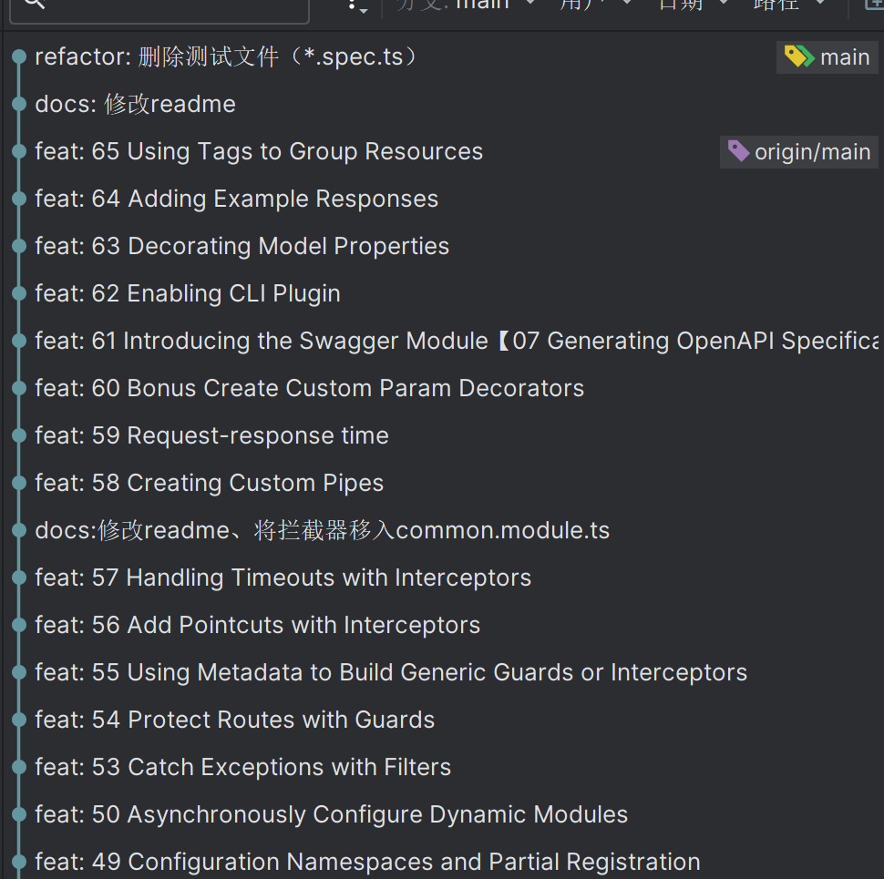

<p align="center">
  <a href="http://nestjs.com/" target="blank"></a>
</p>

## NestJS官方基础课程学习记录
> 记录一下跟着视频学习的每一节课代码，以及遇到的问题，全程跟着敲，每节课做一次提交。[视频来源](https://www.bilibili.com/video/BV1T44y1W7Si?p=1&vd_source=15c86cbe1f7cdf5da4ed11af74fbd689)


如下图所示：每次提交为每节课的标题




#### 记录需要安装依赖的章节

> 前7节概括为安装环境、创建项目，步骤如下

1. 安装[node](https://nodejs.org/zh-cn/)环境
2. 全局安装[nest-cli](https://docs.nestjs.cn/9/firststeps?id=%e8%b5%b7%e6%ad%a5)
3. 使用nest-cli命令创建项目

```bash
nest new
```
4. 运行
```bash
npm run start:dev
```


> 7节至19节为NestJS基础课程（不涉及数据库等）

该部分代码移动至[分支](https://github.com/ytkunkun/NestJSFundamentalsCourseStudy/tree/%E5%9F%BA%E7%A1%80%E8%AF%BE%E7%A8%8B(7-19))（基础课程7-19）


> 20节至22节介绍Docker PostgreSQL

因不了解[Docker](https://www.docker.com/)、[PostgreSQL](https://www.runoob.com/postgresql/postgresql-tutorial.html),该部分改用 MySQL(后续章节确保本地[安装MySQL](https://www.runoob.com/mysql/mysql-tutorial.html))


> 24节安装数据库，使用命令安装对应数据库所需的依赖以及[typeorm](https://github.com/typeorm/typeorm)

原视频使用PostgreSQL
```bash
npm install --save @nestjs/typeorm typeorm pg
```

本人使用MySQL 因而根据 [文档](https://docs.nestjs.cn/9/techniques?id=%e6%95%b0%e6%8d%ae%e5%ba%93) 安装mysql2
```bash
npm install --save @nestjs/typeorm typeorm mysql2
```


> 32节数据迁移，因根据视频操作出现报错等原因，暂时跳过，数据迁移部分暂时也用不到后续在进行学习。

> 33节理论

> 43节安装配置文件
```bash
npm i @nestjs/config
```


> 51节-52节理论

> 61节安装swagger
```bash
npm install --save @nestjs/swagger swagger-ui-express
```


> 62节使用swagger cli插件
```bash
 "compilerOptions": {
    "deleteOutDir": true,
    "plugins": [
      "@nestjs/swagger/plugin"
    ]
  }
```


> 66节-71节为单元测试部分，因是知识盲区，且不影响项目搭建过程暂且跳过后续有空再进行深入学习。

> 72节-80节为第二章MongoDB补充部分，因无MongoDB的需求暂不做学习与MySQL类似


#### bug记录
- 25节疑似typeorm0.3以上版本findOne用法发生变化可改用findOneBy，但是在27节需要使用relations又改回了findOne并查阅findOne新用法

```js
const loadedPhoto = await AppDataSource.getRepository(Photo).findOne({
    where: {
        id: 1,
    },
    relations: {
        albums: true,
    },
})
```


- 46节@hapi/joi报错 改用 joi

```bash
视频：
npm i --save-dev @types/hapi__joi
import * as Joi from '@hapi/joi';

本人：
npm i joi
import * as Joi from 'joi';

```

- 57节 throwError(new RequestTimeoutException())被弃用


```bash
旧：return throwError(new RequestTimeoutException()); 
新：return throwError(() => new RequestTimeoutException());
```
